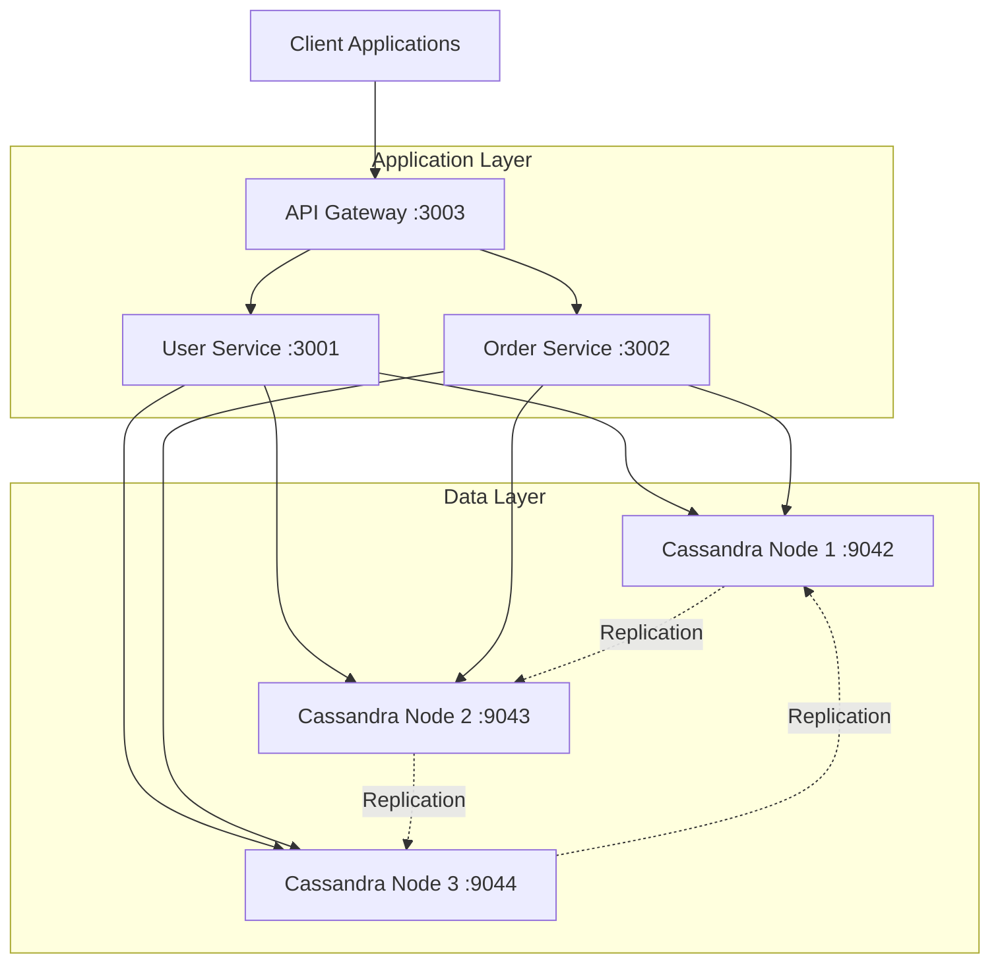

## Apache Cassandra và Ứng dụng trong Hệ thống Blog Phân tán

### Phần 1: Tổng quan về Apache Cassandra

#### 1. Mục đích của thư viện Apache Cassandra

##### Mục đích chính

Apache Cassandra là một hệ quản trị cơ sở dữ liệu phân tán (NoSQL) mã nguồn mở, được thiết kế để xử lý lượng lớn dữ liệu trên nhiều máy chủ, đảm bảo **tính sẵn sàng cao** mà không có **điểm lỗi duy nhất (SPOF - Single Point of Failure)**.

#### Các vấn đề mà Cassandra giải quyết

- **Khả năng mở rộng theo chiều ngang (Horizontal Scalability):** Dễ dàng thêm node mới để tăng hiệu năng xử lý.
- **Tính sẵn sàng cao (High Availability):** Dữ liệu được sao chép trên nhiều node để đảm bảo hệ thống luôn hoạt động.
- **Hiệu suất ghi cao:** Tối ưu hóa cho các thao tác ghi – phù hợp với các ứng dụng có lượng ghi lớn.
- **Phân tán địa lý (Geo-distribution):** Cho phép triển khai trên nhiều trung tâm dữ liệu nhằm giảm độ trễ.
- **Xử lý lượng dữ liệu lớn:** Hỗ trợ quản lý dữ liệu ở quy mô terabyte đến petabyte.

---

### 2. Điểm mạnh của Apache Cassandra

- **Không có điểm lỗi duy nhất (No SPOF):** Kiến trúc phi tập trung, không có master node.
- **Tuyến tính mở rộng:** Hiệu suất tăng gần như tuyến tính theo số lượng node.
- **Bền bỉ (Durability):** Dữ liệu được sao lưu và có thể backup dễ dàng.
- **Tunable consistency:** Cho phép tùy chỉnh giữa Consistency, Availability, và Partition tolerance theo CAP theorem.
- **Ngôn ngữ truy vấn CQL:** Dễ làm quen vì cú pháp tương tự SQL.
- **Hiệu suất cao:** Nhờ mô hình lưu trữ dựa trên LSM-tree.

---

### 3. Điểm yếu của Apache Cassandra

- **Hạn chế trong truy vấn phức tạp:** Không hỗ trợ JOIN, GROUP BY như các hệ quản trị RDBMS.
- **Mô hình dữ liệu cần thiết kế trước:** Cần xác định trước các pattern truy vấn để tối ưu schema.
- **ACID chưa đầy đủ:** Chỉ đảm bảo ACID ở cấp độ hàng (row-level).
- **Cập nhật và xóa dữ liệu tốn tài nguyên:** Do sử dụng mô hình append-only.
- **Tiêu thụ bộ nhớ lớn:** Cần nhiều RAM để hoạt động hiệu quả.
- **Chi phí vận hành:** Quản lý và bảo trì cluster phức tạp, yêu cầu kỹ năng chuyên sâu.

---

### 4. So sánh với các hệ thống cơ sở dữ liệu khác

| Đặc điểm               | Apache Cassandra    | MongoDB             | Redis               | MySQL               |
|------------------------|---------------------|----------------------|---------------------|---------------------|
| Mô hình dữ liệu        | Column-family store | Document store       | Key-value store     | Relational          |
| Mở rộng                | Horizontal          | Horizontal (sharding)| Cluster (Redis)     | Chủ yếu Vertical    |
| Tính nhất quán         | Tunable             | Tunable              | Strong              | Strong              |
| Truy vấn phức tạp      | Hạn chế              | Hỗ trợ tốt           | Rất hạn chế         | Hỗ trợ đầy đủ       |
| Hiệu suất ghi          | Rất cao              | Cao                  | Cực cao             | Trung bình          |
| Khả năng phân tán      | Rất tốt              | Tốt                  | Trung bình          | Hạn chế              |
| Transaction            | Row-level           | Document-level       | Không đầy đủ        | Đầy đủ              |

---

### 5. Ứng dụng phổ biến của Apache Cassandra

- Hệ thống lưu trữ **tin nhắn và log** thời gian thực
- Hệ thống lưu trữ dữ liệu **IoT**
- **Hệ thống đề xuất sản phẩm**
- Hệ thống phân tích thời gian thực (real-time analytics)
- Các ứng dụng xã hội quy mô lớn như **Netflix**, **Twitter**, **Facebook**
- Hệ thống lưu trữ và phân tích dữ liệu **thời tiết**
- Các hệ thống cần khả năng mở rộng và tính sẵn sàng cao

---

## Phần 2: Dự án giữa kì

## 📋 Tổng Quan

Hệ thống **quản lý người dùng và đơn hàng** được xây dựng với kiến trúc **microservices phân tán**, sử dụng **Apache Cassandra** làm cơ sở dữ liệu. Dự án được thiết kế với khả năng mở rộng cao, fault tolerance và bao gồm framework testing toàn diện để đảm bảo tính ổn định trong môi trường production.

### 🎯 Mục Tiêu Dự Án

Xây dựng một **hệ thống thương mại điện tử cơ bản** với các tính năng:
- **👤 Quản lý người dùng**: Tạo, xem, cập nhật thông tin người dùng
- **🛒 Quản lý đơn hàng**: Tạo đơn hàng, theo dõi trạng thái, lịch sử mua hàng
- **🏗️ Kiến trúc microservices**: API Gateway, User Service, Order Service
- **🗄️ Database phân tán**: 3-node Cassandra cluster với replication factor = 3
- **🧪 Testing framework**: 6 test suites toàn diện đảm bảo chất lượng
- **📊 Monitoring & Logging**: Giám sát real-time và logging tập trung
- **🚀 Deployment tự động**: Docker Compose và recovery mechanisms

## 👥 Phân Chia Công Việc Nhóm

### 🧑‍💻 **Nhật:** - [@ducknhat13](https://github.com/ducknhat13)
- Thiết kế hệ thống kiến trúc tổng thể
- Thiết kế API, kết nối thư viện Cassandra
- Test 2 tiêu chí mở rộng:
  - System Recovery
  - Deployment Automation
- Viết Blog, Readme

### 👨‍💻 **Dũng:**
- Xây dựng bộ tiêu chí kiểm thử bắt buộc:
  - Fault Tolerance
  - Distributed Communication
  - Replication
  - Logging
  - Basic Stress Test
- Đóng gói và triển khai Dockerfile
- Tạo scripts mô phỏng lỗi

## 🏛️ Kiến Trúc Hệ Thống



## ✅ Tiêu Chí Kiểm Thử (6/6 Hoàn Thành)

### 🎯 Tiêu Chí Bắt Buộc (4/4) ✅

| Tiêu Chí | Mô Tả | Status |
|----------|-------|--------|
| 🌐 **Distributed Communication** | Giao tiếp HTTP giữa microservices phân tán | ✅ PASS |
| 🔄 **Data Replication** | Nhân bản dữ liệu trên 3 Cassandra nodes | ✅ PASS |
| 📊 **Simple Monitoring/Logging** | Hệ thống giám sát và logging | ✅ PASS |
| ⚡ **Basic Stress Test** | Kiểm tra hiệu suất under high load | ✅ PASS |

### 🏆 Tiêu Chí Phụ (2/2) ✅

| Tiêu Chí | Mô Tả | Status |
|----------|-------|--------|
| 🔧 **System Recovery** | Khả năng phục hồi sau failure scenarios | ✅ PASS |
| 🚀 **Deployment Automation** | Tự động hóa triển khai với Docker Compose | ✅ PASS | `npm run test:deployment` |

## 🚀 Hướng Dẫn Khởi Động

### Yêu Cầu Hệ Thống

- **Docker** 20.0+ & **Docker Compose** 2.0+
- **Node.js** 16.0+ & **npm** 8.0+
- **Minimum 4GB RAM** và **2GB free storage**
- **Windows/Linux/macOS** support

## 🛠️ Công Nghệ Sử Dụng

| Component | Technology | Version | Purpose |
|-----------|------------|---------|---------|
| **Database** | Apache Cassandra | 4.x | Distributed NoSQL database |
| **Runtime** | Node.js | 16+ | JavaScript runtime |
| **Framework** | Express.js | 4.18+ | Web application framework |
| **Containerization** | Docker & Docker Compose | 20.0+ | Container orchestration |
| **HTTP Client** | Axios | 1.6+ | HTTP request library |
| **Logging** | Winston | 3.17+ | Structured logging |
| **Testing** | Manual Testing | - | Manual test execution and verification |

## 📡 API

### 🔗 API Gateway (localhost:3003)
- `GET /health` - Health check with uptime & nodeId
- `GET /monitoring` - System overview & service status
- `GET /metrics` - Performance metrics & request stats  
- `GET /logs` - Web-based log viewer (50 recent entries)
- `POST /api/orders` - Create new order (proxy to Order Service)
- `GET /api/orders` - List orders (proxy to Order Service)

### 👤 User Service (localhost:3001)
- `GET /health` - Service health status
- `GET /users` - List all users
- `POST /users` - Create new user

### 🛒 Order Service (localhost:3002)
- `GET /health` - Service health status  
- `GET /orders` - List all orders
- `POST /orders` - Create new order

## Kiểm thử

### Kiểm Tra Trạng Thái Hệ Thống

```bash
# Xem status containers
docker-compose -f docker-compose.distributed.yml ps

# Xem logs real-time
docker-compose -f docker-compose.distributed.yml logs -f

# Xem logs của service cụ thể
docker-compose -f docker-compose.distributed.yml logs api_gateway
docker-compose -f docker-compose.distributed.yml logs user_service
docker-compose -f docker-compose.distributed.yml logs cassandra1
```

### Kiểm Thử Thủ Công

## 1. Khởi động hệ thống
```bash
# Khởi động toàn bộ hệ thống
docker-compose -f docker-compose.distributed.yml up -d

# Kiểm tra trạng thái các container
docker-compose -f docker-compose.distributed.yml ps

# Theo dõi logs tất cả services
docker-compose -f docker-compose.distributed.yml logs -f
```

## 2. Kiểm tra tình trạng các service
```bash
# Kiểm tra API Gateway
curl http://localhost:3003/health

# Kiểm tra User Service
curl http://localhost:3001/health

# Kiểm tra Order Service  
curl http://localhost:3002/health
```

## 3. Kiểm tra Cassandra Cluster
```bash
# Kết nối vào cassandra1
docker exec -it cassandra1 cqlsh

# Trong cqlsh, kiểm tra cluster status
DESCRIBE CLUSTER;
SELECT * FROM system.peers;

# Tạo keyspace với replication factor = 3
CREATE KEYSPACE IF NOT EXISTS demo_ks WITH replication = {
    'class': 'SimpleStrategy',
    'replication_factor': 3
};

# Sử dụng keyspace
USE demo_ks;

# Tạo bảng demo
CREATE TABLE IF NOT EXISTS users (
    id UUID PRIMARY KEY,
    name TEXT,
    email TEXT,
    created_at TIMESTAMP
);
```

## 4. Demo Distributed Communication
```bash
# Tạo user mới qua API Gateway
curl -X POST http://localhost:3003/api/users \
  -H "Content-Type: application/json" \
  -d '{"name": "John Doe", "email": "john@example.com"}'

# Lấy danh sách users
curl http://localhost:3003/api/users

# Tạo order
curl -X POST http://localhost:3003/api/orders \
  -H "Content-Type: application/json" \
  -d '{"user_id": "user-id-here", "product": "Laptop", "amount": 1500}'

# Lấy danh sách orders
curl http://localhost:3003/api/orders
```

## 5. Demo Fault Tolerance
```bash
# Dừng cassandra2
docker stop cassandra2

# Kiểm tra hệ thống vẫn hoạt động
curl http://localhost:3003/api/users

# Khởi động lại cassandra2
docker start cassandra2

# Dừng user_service
docker stop user_service

# Kiểm tra API Gateway xử lý lỗi
curl http://localhost:3003/api/users

# Khởi động lại user_service
docker start user_service
```

## 6. Demo Replication
```bash
# Kết nối vào cassandra1
docker exec -it cassandra1 cqlsh -k demo_ks

# Thêm dữ liệu
INSERT INTO users (id, name, email, created_at) VALUES (uuid(), 'Test User 1', 'test1@example.com', toTimestamp(now()));

# Kết nối vào cassandra2 và kiểm tra dữ liệu đã được replicate
docker exec -it cassandra2 cqlsh -k demo_ks -e "SELECT * FROM users;"

# Kết nối vào cassandra3 và kiểm tra
docker exec -it cassandra3 cqlsh -k demo_ks -e "SELECT * FROM users;"
```

## 7. Stress Test
```bash
# Sử dụng Apache Bench để test API Gateway
ab -n 1000 -c 10 http://localhost:3003/api/users

# Hoặc sử dụng curl với loop
for i in {1..100}; do
  curl -X POST http://localhost:3003/api/users \
    -H "Content-Type: application/json" \
    -d "{\"name\": \"User $i\", \"email\": \"user$i@example.com\"}" &
done
wait
```

## 8. Monitoring và Logging
```bash
# Xem logs của API Gateway
docker logs -f api_gateway

# Xem logs của User Service
docker logs -f user_service

# Xem logs của Order Service
docker logs -f order_service

# Xem logs của Cassandra
docker logs -f cassandra1

# Xem resource usage
docker stats
```

## 9. System Recovery Demo
```bash
# Dừng toàn bộ hệ thống
docker-compose -f docker-compose.distributed.yml down

# Khởi động lại với persistent data
docker-compose -f docker-compose.distributed.yml up -d

# Kiểm tra dữ liệu vẫn còn
curl http://localhost:3003/api/users

```

### Khắc Phục Sự Cố

| Issue | Solution |
|-------|----------|
| 🔴 **Services won't start** | Check Docker memory allocation (min 4GB) |
| 🔴 **Test timeouts** | Wait longer for Cassandra cluster initialization |
| 🔴 **Port conflicts** | Ensure ports 3001-3003, 9042-9044 are available |
| 🔴 **Connection refused** | Verify all containers are running with `docker ps` |


## [Mọi băn khoăn có tại](https://github.com/ducknhat13/distributed-syst)

## 🙏 Lời Cảm Ơn

- Xin chân thành cảm ơn giảng viên (Ths.Phạm Kim Thành) đã tận tình hướng dẫn và hỗ trợ trong suốt quá trình học tập và thực hiện dự án này.
- Cảm ơn ChatGPT đã giúp đỡ tôi trong việc giải đáp thắc mắc và hỗ trợ viết code, tài liệu một cách hiệu quả.

---